# Richer Biomes world generation ideas

Richer Biomes reshapes Terraria's existing biomes without replacing their materials, progression, or identity. The world remains readable as Terraria, but its terrain gives the player more reasons to climb, descend, explore, and choose a route.

This document defines the intended player experience. It records design rules and candidate terrain families, not an implementation. Ideas marked as experiments need prototypes before they become requirements.

## The world should invite movement

The mod follows these firm rules.

- Keep each vanilla biome recognizable by its materials, plants, structures, and position in progression.
- Give every major region at least one route that a new character can follow without a hook, wings, explosives, or placed blocks.
- Use generated ledges, slopes, roots, platforms, ropes, tunnels, and switchbacks to support that route.
- Keep digging useful. A player with ordinary tools can cut a direct path instead of following the natural route.
- Place striking terrain between quieter stretches. Players need room for towns, arenas, farms, and their own construction.
- Preserve the purpose and required contents of spawn, the Dungeon, the Jungle Temple, the oceans, the Aether, and other progression sites.
- Build for a coherent Richer Biomes world. Compatibility with other mods that replace world generation is not a design constraint.
- Use vanilla tiles, walls, liquids, furniture, plants, traps, and objects. New blocks, enemies, items, music, and progression systems remain out of scope.

Tall terrain alone does not create vertical play. A sheer wall leaves one choice: stop and dig. Good vertical terrain offers several readable paths at different heights, then lets the player decide how much effort to spend on a shortcut.

## Ideas have three ranks

| Rank | Meaning |
| --- | --- |
| Foundation | A rule or system that other terrain depends on. |
| Biome application | A use of the foundation in a specific biome or world layer. |
| Optional experiment | A promising idea with enough technical or balance risk to require an isolated prototype. |

The first useful prototype needs the foundations and one complete route through a forest, a mountain, and a surface mine. It does not need every biome at once.

## Generate landforms before biome details

### Foundation: a world skeleton

Generation first divides the horizontal world into broad landform regions. Candidate regions include lowlands, basins, valleys, uplands, mountain ranges, coasts, and fault zones. Each region records its elevation trend, roughness, surface thickness, likely cave entrances, and connections to its neighbors.

Biome assignment changes the materials and local shapes of a region. It does not erase the region. A mountain can therefore continue from a forest into snow, while a valley can pass through forest and jungle with a visible transition between them.

This order prevents each biome from becoming a separate height-map patch. It also gives rivers, passes, cave systems, and roads a reason to cross biome boundaries.

### Foundation: a route network

The world skeleton reserves a connected route across the surface before it adds cliffs, structures, or liquids. Branches lead from that route to biome landmarks and surface entrances. Regional cave generation reserves its own loops between the Underground and Cavern layers.

The route network follows these rules.

- At least one surface route crosses every major landform with starter movement.
- A generated rope, platform run, or short safe drop can join two route segments.
- Deep water, lava, traps, and mandatory mining cannot block the only route.
- Mountains need a pass or a climbable outer route as well as internal caves.
- Large caves need more than one exit unless they are a deliberate dead-end landmark.
- Direct digging remains possible beside the generated routes.

Automated route validation is a foundation in the design, but its exact method is an optional experiment. A later prototype must prove that it can test reachability without rejecting most interesting seeds.

### Foundation: landmarks need quiet neighbors

Every region receives a budget for major landmarks, minor features, and quiet terrain. A major landmark can occupy several screens. A minor feature can alter one route or reveal a small cave. Quiet terrain keeps a simpler silhouette and enough flat ground for building.

Two major landmarks should not touch unless the combination is the point of the seed. A surface mine at the foot of a mountain is a useful combination. A mine, giant tree, waterfall, chasm, and cabin in the same screen is noise.

### Foundation: transition zones

Biome borders become short regions with their own terrain rules. A transition zone combines the landforms of both neighbors while changing materials gradually. It must remain wide enough to read during play, but narrow enough that the two main biomes keep distinct identities.

Candidate transition zones include:

- Wooded foothills between a forest and a mountain.
- Thawing valleys with exposed stone and meltwater between a forest and snow.
- Dry grass, eroded stone, and shallow ravines between a forest and desert.
- Jungle escarpments where mud terraces climb out of a forest valley.
- Blighted drainage basins where an evil biome reaches an ordinary biome.
- Crystal outcrops and pale grass at a Hardmode Hallow boundary.
- Salt-stained dunes or low coastal cliffs between an inland biome and an ocean.

Sharp borders still have a place. A fault, river, cliff, or chasm can create one when its shape explains the break.

### Foundation: local watersheds

Water links nearby elevations instead of crossing the entire world. A spring may feed a pond, a short stream, a waterfall, and an underground drain within one or two regions. The drainage point should join a cave that can hold the water without flooding an unrelated structure.

Local watersheds can create forest streams, desert oases, snowmelt falls, jungle cenotes, and coastal pools. Long world-scale rivers remain out of scope because Terraria's liquids and narrow world profile make them expensive to place and hard to protect.

Liquid routing is an optional experiment. The prototype must test settling time, leakage through later generation passes, and collisions with cabins, the Dungeon, the Temple, and mine tunnels.

### Foundation: regional cave shapes

Surface biomes influence the caves beneath them. Each region defines preferred chamber shapes, tunnel directions, entrance types, liquids, hazards, and landmark rooms. The deeper Cavern layer can blend two adjacent regional styles rather than changing at a vertical line.

Regional rules do not fill every tile. Some ordinary stone caves remain between them, both for contrast and for familiar mining space.

## Focus idea: vertical forests

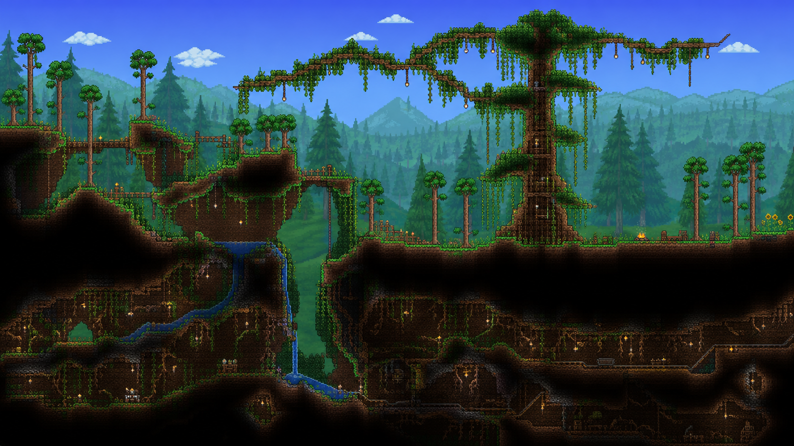

**Rank.** Foundation example and biome application.

**Purpose.** Forests become the clearest introduction to layered routes. The player can travel under roots, along the ground, over ridges, or through occasional canopy shortcuts.

**Large-scale shape.** A forest alternates between shallow valleys and wooded ridges. Gullies cut into the valleys, while a few large trees join ledges across the slopes. Calm clearings separate the more complex sections.

**Natural routes.** The lowest route follows root caves and dry gullies. The main route crosses the forest floor. A high route uses ridgelines, thick branches, Living Wood rooms, and short platform runs. Small connections between the layers let the player change routes without walking back to the start.

**Underground connection.** Root caves begin as visible gaps beneath trees or eroded banks. They widen into dirt chambers, then merge into the regional stone caves. Some carry a stream from a hillside spring.

**Landmark variants.** Use a split-ridge grove, a tree bridge over a ravine, a waterfall hollow, a terraced clearing, or a Living Tree overlook. Keep giant trees uncommon so each one remains useful for navigation.

**Vanilla materials.** Use Dirt, Stone, Grass, Living Wood, Leaf Blocks, Wood, wooden platforms, rope, vines, plants, water, and natural background walls.

**Safeguards.** Do not let leaf masses hide the only route. Keep starter jumps short and show the next landing. Leave building clearings near spawn and between landmarks. Avoid narrow pits that catch the player unless a side exit is visible.

### Suggested forest variants

- **Ravine forest.** Two wooded shelves flank a narrow gully. Roots form low bridges, while a cave passes beneath the deepest cut.
- **Spring valley.** Water emerges below a ridge, crosses a small pond, and drains through a root cave.
- **Wooded plateau.** A broad, buildable top sits above shallow caves and climbable slopes.
- **Fallen crossing.** Living Wood and leaf shapes suggest a fallen trunk across a gap without requiring a new tree asset.
- **Terraced grove.** Several short slopes create natural town levels instead of one flat platform.

## Focus idea: mountains

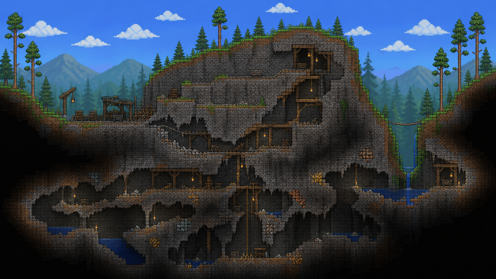

**Rank.** Foundation example and cross-biome landform.

**Purpose.** Mountains create long-range silhouettes and meaningful route choices. They also join neighboring biomes instead of acting as a separate biome with unrelated content.

**Large-scale shape.** A mountain begins with foothills, rises through several shelves, reaches one dominant ridge or summit, then descends through a pass or valley. The interior contains caves and chimneys, but enough solid ground remains for mining and building.

**Natural routes.** A switchback climbs the outer slope. A pass offers the easiest crossing. Ledges create a faster high route for players with movement gear. One internal cave can bypass part of the climb, but it must return to the surface before becoming a generic deep cave.

**Underground connection.** Crevices and mine entrances join sloped chambers within the mountain. Deeper shafts meet the Underground layer near the mountain's base rather than dropping straight to the Cavern layer.

**Landmark variants.** Use a split peak, a high lake, a natural arch, a summit shrine assembled from vanilla furniture, an exposed ore face, or a waterfall that disappears into the mountain.

**Vanilla materials.** Use the blocks and walls of the inherited biome. Add Stone, Dirt, clay, sand, snow, ice, mud, vines, thorns, crystals, and liquids only where the local biome already supports them.

**Safeguards.** No mountain can span the full region as an unclimbable wall. Keep the pass above the Underground boundary and clear of deep liquid. Do not place the summit so high that normal surface enemies or weather stop behaving sensibly. Preserve enough soil on outer slopes for biome plants and trees.

### Mountains inherit their biome

| Variant | Shape and route identity |
| --- | --- |
| Forest mountain | Soil shelves, wooded switchbacks, root caves, and a bare stone summit. |
| Snow mountain | Broad snowfields, ice ledges, sheltered caves, and a climb that avoids the steepest ice face. |
| Jungle mountain | Mud terraces, vine drops, waterfalls, and dense internal chambers with several exits. |
| Desert mountain | Wind-cut stone and sandstone, dry passes, overhangs, and a buried lower route. |
| Evil mountain | A cracked ridge, thorn-lined shelves, and a chasm that exposes infected stone without blocking travel. |
| Hallow mountain | Pale terraces, crystal caves, a bright summit, and gaps that reward movement gear without requiring it. |

## Focus idea: surface mines

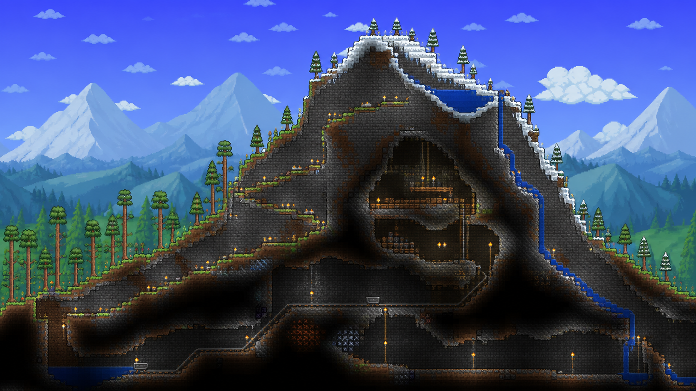

**Rank.** Foundation example and biome application.

**Purpose.** A surface mine gives the player a visible invitation to go underground. Its abandoned structures tell a small story, while its natural branches keep it from feeling like a repeated prefab.

**Large-scale shape.** The surface begins as a quarry, collapsed cut, or work yard. One main shaft descends in stages. Side tunnels transition from supported excavation to natural regional caves.

**Natural routes.** Ramps, wooden platforms, ropes, and minecart track make the main descent readable. Collapsed sections create short detours instead of dead ends. A secondary exit can emerge from a hillside or nearby gully.

**Underground connection.** The worked tunnels stop before they dominate the cave system. Beyond the last supports, the mine follows an ore seam or fault into the local cave grammar.

**Landmark variants.** Use an open quarry, a hillside adit, a collapsed headframe, a flooded lower cut, a minecart switch room, or a tiny workers' cabin. A mountain-foot mine can combine with one mountain landmark without consuming another region's landmark budget.

**Vanilla materials.** Use Wood, Boreal Wood where appropriate, wooden beams, fences, platforms, rope, minecart track, torches, chests, work benches, Stone, Dirt, background walls, and biome-specific blocks.

**Safeguards.** Keep ore rewards modest and close to normal world distribution. Do not guarantee rare ore, accessories, or progression skips. Prevent tracks from entering sealed progression structures. Give flooded mines a dry upper route. Make supports sparse enough that the mine still reads as abandoned.

### Surface mine variants

- **Open cut.** Wide terraces expose stone and a few ordinary ore veins before narrowing into a shaft.
- **Hillside adit.** A supported horizontal tunnel enters a ridge and meets a vertical natural cave.
- **Collapsed shaft.** Broken platforms and a side passage lead around the collapse.
- **Flooded works.** A dry work yard overlooks a water-filled lower chamber with a separate drainage cave.
- **Rail junction.** A short minecart line joins two cave branches without becoming a world-spanning transport system.

## Surface biome applications

### Desert mesas and dry channels

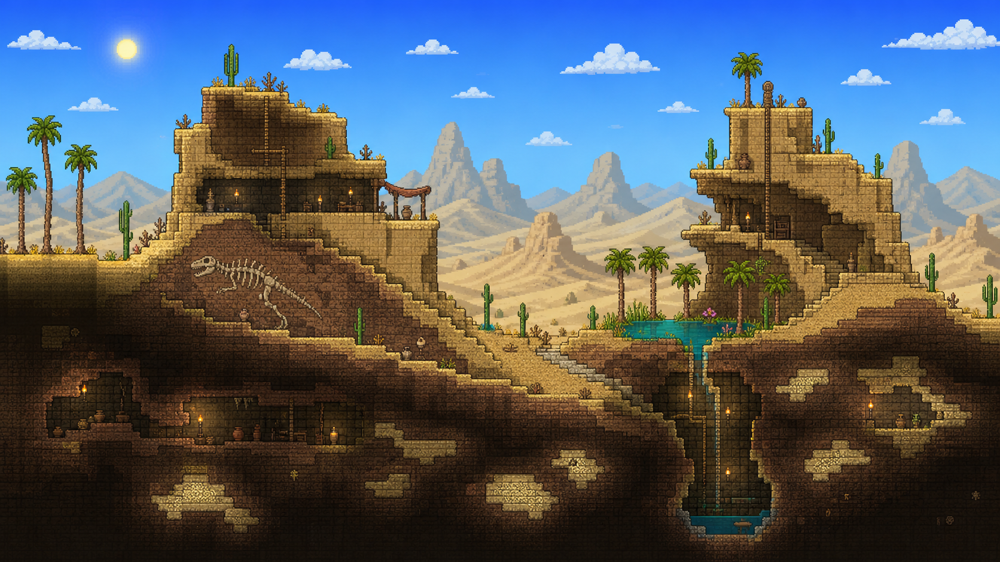

**Rank.** Biome application.

**Purpose.** The desert gains visible layers and sheltered routes without losing its exposed, hostile character.

**Large-scale shape.** Low dunes lead to mesas, eroded shelves, and dry channels. Oasis basins interrupt the open ground, while hardened layers hold overhangs and slot passages.

**Natural routes.** The player can cross dune crests, follow a dry channel, or use shaded passages through a mesa. Ledges prevent long sand slopes from becoming slow walls.

**Underground connection.** Sinkholes and buried channels lead toward the Underground Desert. The transition passes through sandstone pockets before it reaches large antlion chambers.

**Landmark variants.** Use an oasis sinkhole, a split mesa, a fossil cut, a buried entrance, or a sandstone slot canyon.

**Vanilla materials.** Use Sand, Hardened Sand, Sandstone, their walls, Cactus, Palm Wood, fossils, water, and desert furniture.

**Safeguards.** Keep loose sand away from the only route and from structures that later passes may hollow out. Do not let sinkholes drop a new character directly into the Underground Desert. Preserve broad areas where desert enemies can spawn.

### Snow shelves and glacial valleys

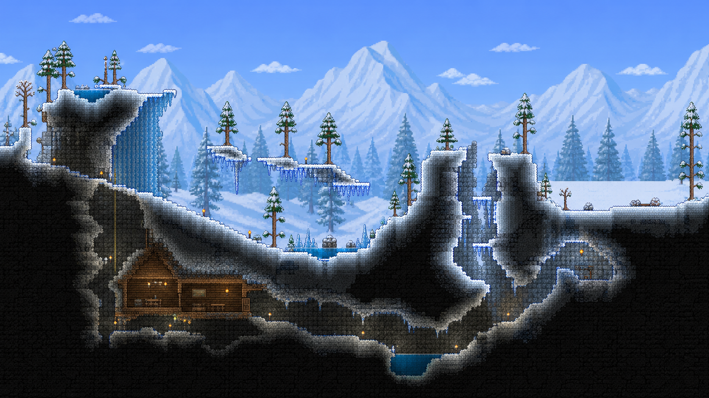

**Rank.** Biome application.

**Purpose.** Snow terrain turns elevation into broad, readable steps rather than a sequence of narrow spikes.

**Large-scale shape.** A shallow glacial valley sits between snow shelves and one higher frozen ridge. Crevasses break the ridge, and exposed stone appears near steep faces.

**Natural routes.** Snow ramps form the main crossing. Ice ledges offer faster but less forgiving routes. Sheltered caves bypass the steepest faces.

**Underground connection.** Crevasses descend into ice chambers and slush pockets. Meltwater can drain into a frozen cave without flooding the main route.

**Landmark variants.** Use a frozen waterfall, a split glacier, an ice chimney, a buried Boreal cabin, or a high frozen pond.

**Vanilla materials.** Use Snow, Ice, Thin Ice, Slush, Stone, Boreal Wood, platforms, rope, water, and ice walls.

**Safeguards.** Never use Thin Ice on the only crossing. Keep the climb readable against white backgrounds. Do not turn the entire biome into steep ground because players need flat snow for building and enemy encounters.

### Jungle terraces and cenotes

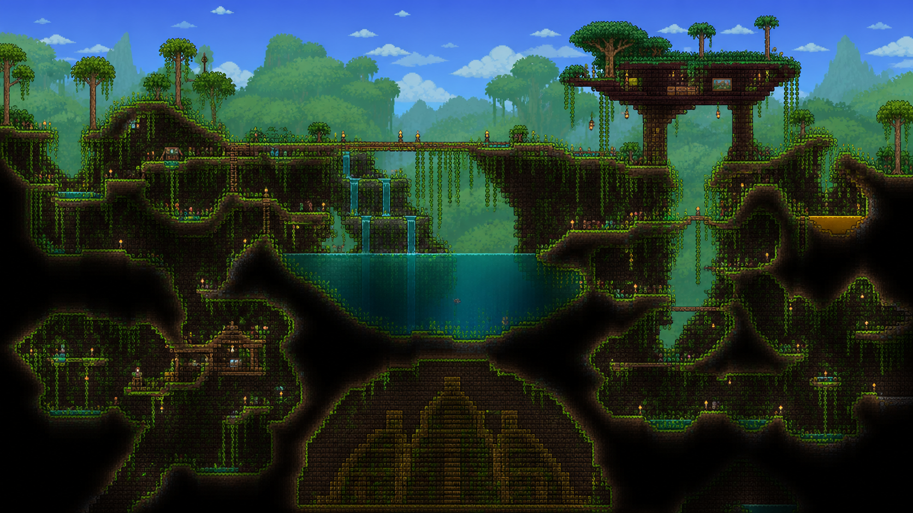

**Rank.** Biome application.

**Purpose.** The Jungle feels dense because routes overlap and reconnect, not because every space is blocked by mud and plants.

**Large-scale shape.** Mud terraces rise around water-cut basins. Root canyons and overgrown cliffs create several vertical entries into the Underground Jungle.

**Natural routes.** Vines, ledges, Mahogany platforms, and shallow water crossings connect the terraces. A dry upper path avoids the deepest basin.

**Underground connection.** Cenotes and root canyons widen into Jungle chambers. Several entrances spread traffic so the first route does not become a single lethal shaft.

**Landmark variants.** Use a terraced waterfall, a giant Mahogany overlook, a honey seep, a ruined surface hut, or a broad cenote.

**Vanilla materials.** Use Mud, Jungle Grass, Rich Mahogany, vines, jungle plants, water, small honey pockets, Stone, and jungle walls.

**Safeguards.** Keep honey away from required movement routes. Prevent vines and foliage from hiding every landing. Protect the Jungle Temple and its access rules from surface entrances and water routes.

### Evil faults and infected drainage basins

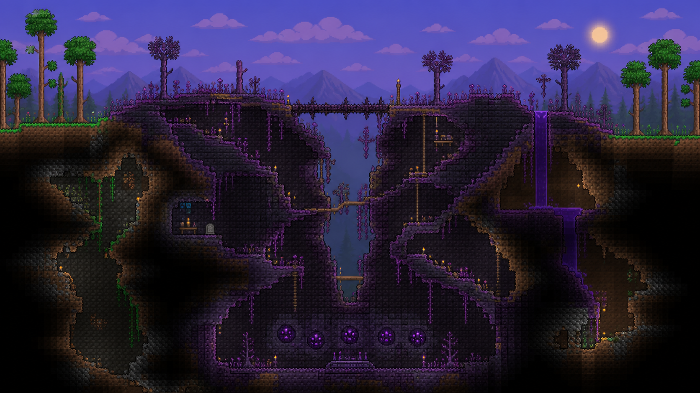

**Rank.** Biome application.

**Purpose.** Corruption and Crimson terrain should look as if the world split or became diseased along a physical feature.

**Large-scale shape.** The biome follows a faulted ridge, a drainage basin, or several branching chasms. Ordinary terrain bends toward the infected center instead of ending at a vertical material boundary.

**Natural routes.** Bridges, ledges, and side tunnels cross the chasms. The player can stay near the rim or descend through the infected interior.

**Underground connection.** Surface cracks join the existing orb or heart chambers. Secondary cracks reconnect with ordinary caves beyond the deepest infected pockets.

**Landmark variants.** Use a forked Corruption chasm, a Crimson sink basin, a thorn bridge, an altar shelf, or an infected waterfall.

**Vanilla materials.** Use Ebonstone or Crimstone, the matching grass and walls, thorns, Demon Altars or Crimson Altars, Shadow Orbs or Crimson Hearts, water, and biome plants.

**Safeguards.** Preserve the expected number and accessibility of Shadow Orbs or Crimson Hearts. Do not make the starter route depend on breaking infected stone. Keep at least one dry crossing above the deepest chasms.

### Hallow ridges and crystal springs

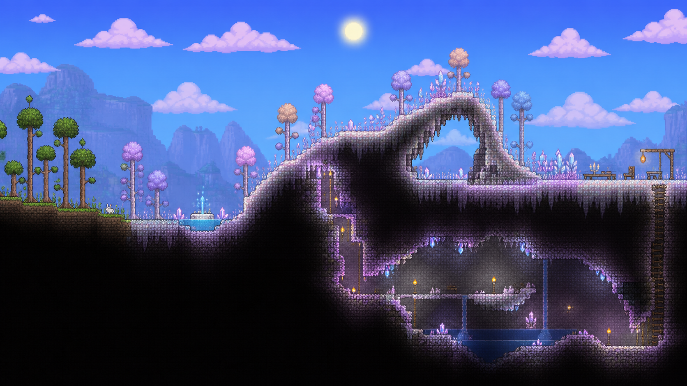

**Rank.** Biome application tied to the Hardmode experiment.

**Purpose.** Hallow terrain should express the landform that it converts instead of painting the same diagonal strip across unrelated shapes.

**Large-scale shape.** Hallow follows selected ridges, valleys, and geological seams after the Wall of Flesh is defeated. Converted mountains gain bright ledges and crystal caves. Converted lowlands gain pale pools and open meadows.

**Natural routes.** Existing pre-Hardmode routes survive conversion. New crystal growth can mark side paths but cannot seal tunnels or narrow required landings.

**Underground connection.** Pearlstone seams connect surface Hallow to Underground Hallow chambers. The route follows existing caves and faults rather than cutting a featureless diagonal tunnel.

**Landmark variants.** Use a crystal spring, a pearlstone arch, a bright summit, a converted mine branch, or an underground crystal hall.

**Vanilla materials.** Use Pearlstone, Pearlsand, Hallowed grass, Crystal Shards, Hallow plants, water, and the matching walls where conversion rules permit them.

**Safeguards.** Preserve enough Underground Hallow for Souls of Light and other progression needs. Do not convert the Jungle Temple, the Dungeon, the Aether, or protected structure interiors. Keep biome spread and player containment strategies recognizable.

### Coasts and stepped oceans

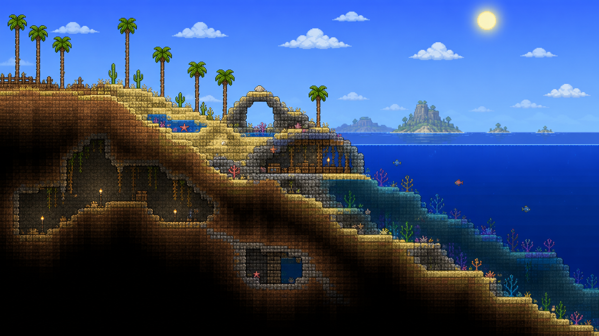

**Rank.** Biome application.

**Purpose.** An ocean begins before the final beach screen. The coast provides a readable descent from the inland biome to deep water.

**Large-scale shape.** Inland ground transitions into dunes, low cliffs, or a sheltered cove. Beneath the water, shelves step down toward the ocean floor instead of dropping through one steep wall.

**Natural routes.** A dry beach route always reaches the shore. Sea caves and shelf pockets create optional routes once the player can breathe or move underwater.

**Underground connection.** A limited number of sea caves join coastal caverns. Most end before they can drain the ocean into a large cave network.

**Landmark variants.** Use a dune-backed beach, a stone cove, a sea arch, a tide-pool shelf, or a shipwreck pocket assembled from vanilla objects where world rules allow one.

**Vanilla materials.** Use Sand, Stone, Shell Piles, Coral, Palm Wood, water, ocean plants, and coastal walls.

**Safeguards.** Preserve the ocean volume and valid space for ocean enemies, fishing, and Angler quests. Do not expose the world edge. Seal sea caves against accidental drainage and keep progression chests reachable under normal vanilla expectations.

### Sky shelves and anchored islands

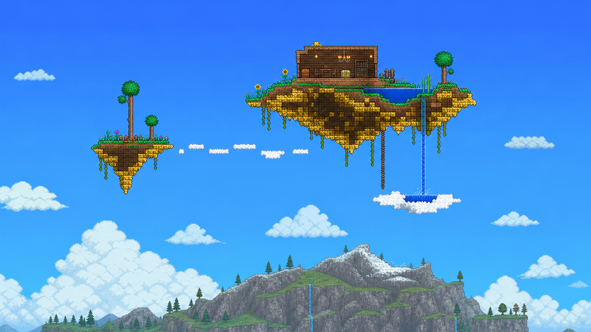

**Rank.** Optional experiment.

**Purpose.** The sky can echo the terrain below without filling open space or making Floating Islands routine.

**Large-scale shape.** A few Floating Islands align loosely with mountain ranges or major faults. Small cloud shelves may suggest a broken path without creating a complete bridge across the sky.

**Natural routes.** No starter route depends on a sky island. Mountains can provide sightlines or later access once the player has suitable movement tools.

**Underground connection.** Sky structures have no required underground connection. A waterfall may visually connect an island to a highland pond if liquid behavior remains stable.

**Landmark variants.** Use a paired island, a cloud stair, a rain-fed island pond, or an island above a mountain summit.

**Vanilla materials.** Use Cloud, Rain Cloud, Sunplate, Dirt, Grass, water, and existing Floating Island structures.

**Safeguards.** Preserve required Floating Island loot and world-size counts. Keep open space for wyverns, gravitation travel, and player construction. Treat falling water as experimental because it can cross many protected regions.

## Underground and Cavern applications

### Rooted underground

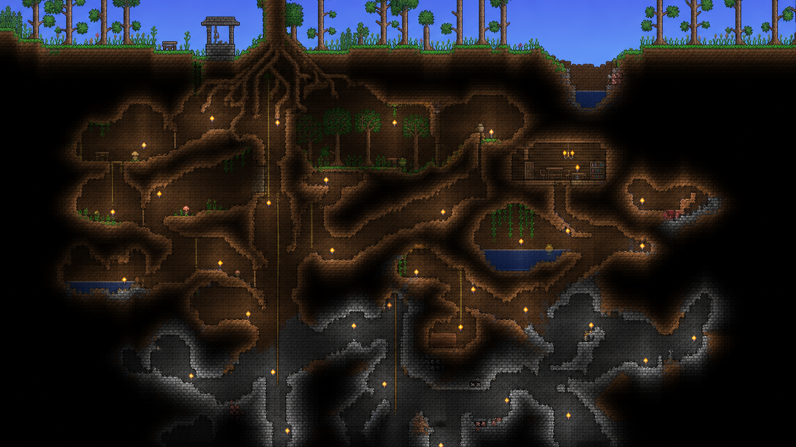

**Rank.** Biome application.

**Purpose.** The ordinary Underground layer becomes a transition from surface soil to stone caverns instead of a uniform web of tunnels.

**Large-scale shape.** Broad dirt chambers sit beneath valleys. Root-shaped columns support the roofs, while stone grows more common with depth.

**Natural routes.** Sloped tunnels and short drops form loops between several surface entrances. Narrow diggable walls separate nearby branches and reward players who read the map.

**Surface connection.** Root gaps, wells, ravines, and mine branches provide visible entrances.

**Landmark variants.** Use a buried grove, a root bridge, a clay pocket, a flooded hollow, or a cabin chamber.

**Vanilla materials.** Use Dirt, Stone, Clay, Wood, Living Wood, roots suggested by walls and blocks, water, pots, and cabin furniture.

**Safeguards.** Keep enough ordinary Dirt and Stone for early resources. Avoid chamber roofs so thin that later surface generation opens them by accident.

### Underground Desert chambers

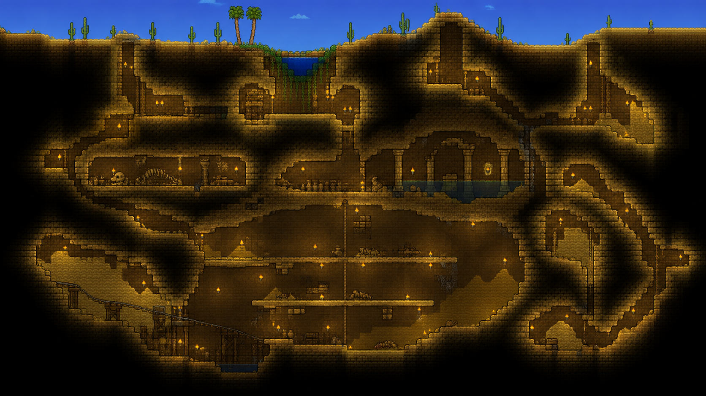

**Rank.** Biome application.

**Purpose.** The Underground Desert keeps its danger and scale while gaining clearer entrances and route loops.

**Large-scale shape.** Sandstone chambers cluster beneath mesas and buried channels. Some rooms follow horizontal sediment layers, while sinkholes form the main vertical links.

**Natural routes.** Supported ledges and hardened shelves cross the largest chambers. Side loops let the player retreat without returning through one narrow entrance.

**Surface connection.** Oasis sinkholes, mesa passages, and buried cuts lead into upper sandstone rooms before they reach antlion territory.

**Landmark variants.** Use a fossil gallery, a collapsed cistern, a layered sandstone hall, or a buried rail cut.

**Vanilla materials.** Use Sandstone, Hardened Sand, desert walls, fossils, rolling cactus hazards where valid, and ordinary Underground Desert objects.

**Safeguards.** Preserve the biome size and valid enemy-spawn walls. Keep falling sand from collapsing required paths or exposing the biome during unrelated generation passes.

### Frozen fissures

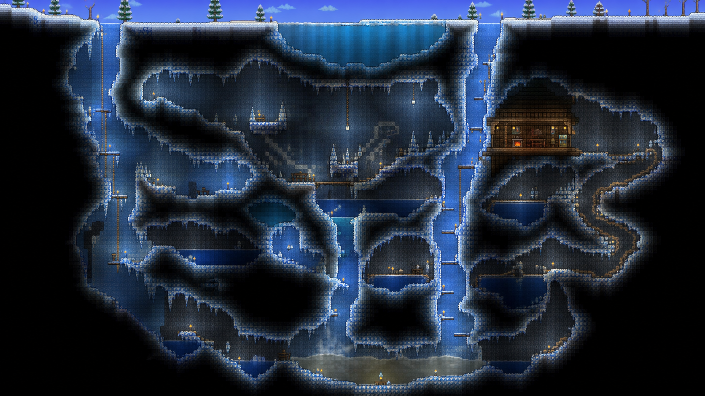

**Rank.** Biome application.

**Purpose.** Underground Snow gets a stronger vertical identity through fissures, ice shelves, and sheltered rooms.

**Large-scale shape.** Tall cracks connect broad ice chambers. Slush and stone collect near the bottoms, while solid shelves interrupt long drops.

**Natural routes.** Alternating ledges create a safe descent. Side caves provide loops around Thin Ice or flooded pockets.

**Surface connection.** Glacial crevasses and sheltered mountain caves enter the upper fissures.

**Landmark variants.** Use an ice chimney, a frozen lake ceiling, a Boreal cabin shelf, or a slush basin.

**Vanilla materials.** Use Snow, Ice, Thin Ice, Slush, Stone, Boreal Wood, water, and frozen walls.

**Safeguards.** Limit unavoidable sliding and Thin Ice. Break long falls with visible shelves and keep water away from the only return route.

### Jungle root network

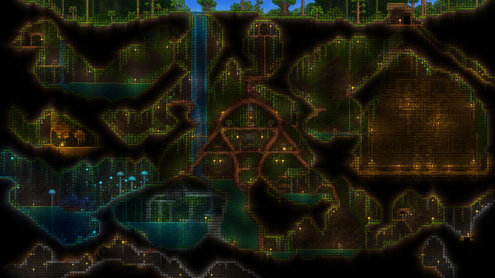

**Rank.** Biome application.

**Purpose.** The Underground Jungle becomes a network of connected basins rather than many isolated bubbles.

**Large-scale shape.** Mud columns and root arches separate wet chambers. Vertical cenotes link the surface to upper rooms, while deeper passages spread sideways toward the Cavern layer.

**Natural routes.** Several looping branches connect each major basin. Vines and platforms support climbs, but dry ledges remain available.

**Surface connection.** Cenotes, root canyons, and mountain waterfalls enter separate parts of the network.

**Landmark variants.** Use a Mahogany root hall, a honey seep, a spore basin, a submerged ruin, or a Temple approach cavern.

**Vanilla materials.** Use Mud, Jungle Grass, vines, Rich Mahogany, water, honey, spores, Jungle walls, and stone.

**Safeguards.** Keep the Jungle Temple sealed and preserve Plantera bulb space. Do not let water or honey consume most enemy-spawn ground. Maintain enough connected Jungle area for Hardmode progression.

### Evil and Hallow depths

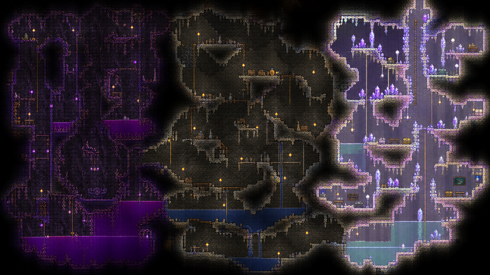

**Rank.** Biome application tied to the Hardmode experiment.

**Purpose.** Infected underground terrain follows faults and drainage paths while retaining the resource and enemy rules players expect.

**Large-scale shape.** Evil caves descend through cracked vertical rooms. Hallow caves favor open shelves and crystal-lined seams. Both reconnect with ordinary Cavern passages at several points.

**Natural routes.** Existing cave loops survive conversion. Chasms receive ledges or side tunnels, and crystal seams cannot seal required routes.

**Surface connection.** Evil faults continue from their surface chasms. Hallow seams emerge at converted springs, ridges, or mines.

**Landmark variants.** Use an altar fault, an infected aquifer, a pearlstone gallery, a crystal chimney, or a converted mine junction.

**Vanilla materials.** Use each biome's stone, sand, grass, walls, plants, altars, crystals, and liquids under vanilla placement rules.

**Safeguards.** Preserve valid areas for Souls of Night and Souls of Light. Protect progression structures and avoid sealing tunnels during conversion.

### Glowing Mushroom basins

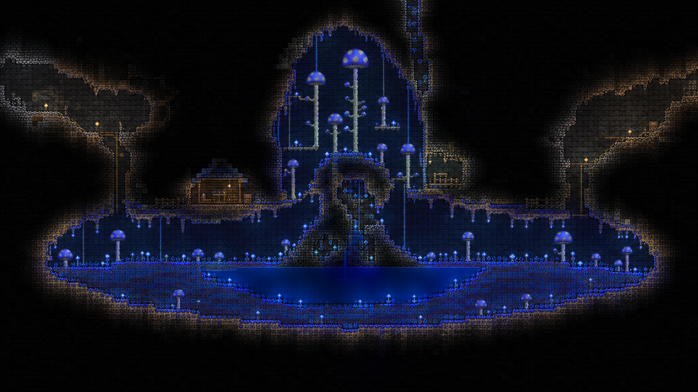

**Rank.** Biome application.

**Purpose.** Glowing Mushroom biomes become visible blue basins with a clear boundary and a usable floor.

**Large-scale shape.** A shallow bowl collects mud around a central water pocket or stone rise. One tall chamber gives Giant Glowing Mushrooms room to define the silhouette.

**Natural routes.** A dry rim circles the basin. Two entrances connect it to adjacent Cavern routes, while ledges cross above the lowest wet ground.

**Surface connection.** None is required. A rare vertical chimney may hint at the biome from an upper cave without converting the surface.

**Landmark variants.** Use a spore lake, a mushroom amphitheater, a split basin, or a cabin at the edge of the glow.

**Vanilla materials.** Use Mud, Mushroom Grass, glowing mushroom plants, water, Stone, and mushroom walls.

**Safeguards.** Preserve valid Truffle Worm space and enough mud for natural growth. Keep at least one large flat area that a player could adapt for the Truffle NPC.

### Stone provinces in the Cavern layer

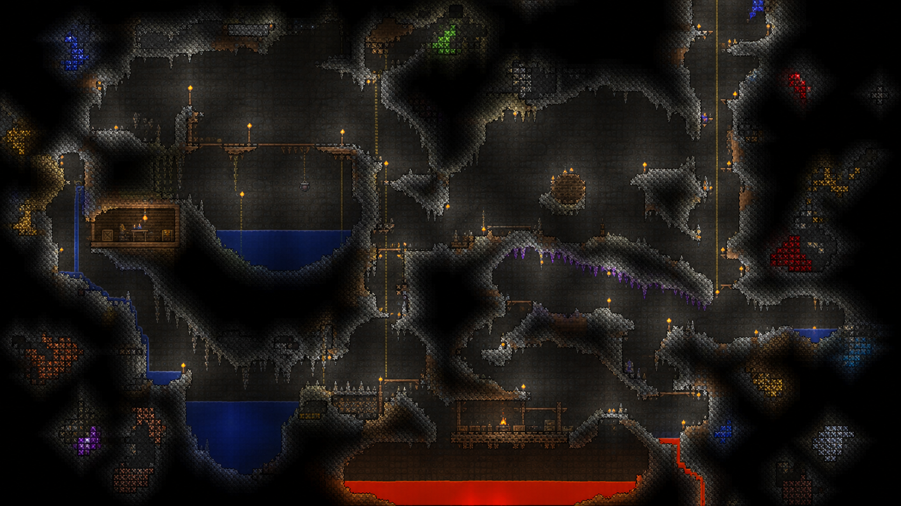

**Rank.** Foundation and biome application.

**Purpose.** The Cavern layer gains large-scale variety without replacing its open mining role.

**Large-scale shape.** Broad stone halls, fault chambers, vertical chimneys, and dense mining zones alternate across the world. The shapes respond to the landform above but become less biome-specific with depth.

**Natural routes.** Major halls connect through two or more passages. Chimneys break long descents with ledges. Dense zones have thin walls that invite mining shortcuts.

**Surface connection.** Regional cave routes and mines feed into separate parts of each province.

**Landmark variants.** Use an underground lake, a fault hall, a mine junction, a lava shelf near the bottom, or a broad gem pocket.

**Vanilla materials.** Use Stone, Dirt, Clay, Silt, ores, gems, water, lava, cabin sets, traps, and natural walls.

**Safeguards.** Keep ore and gem distribution near vanilla balance. Do not fill the layer with giant empty rooms. Leave ordinary cave networks and solid mining ground between provinces.

### Small underground biomes

Granite, Marble, Spider Caves, Bee Hives, and the Aether keep their vanilla identity and required contents. Richer Biomes changes their approaches and nearby terrain more than their internal rules.

| Site | Terrain treatment | Required safeguard |
| --- | --- | --- |
| Granite | Place near faults or deep water routes, with a broken stone approach. | Preserve enough biome blocks and walls for enemies and materials. |
| Marble | Place beside broad Cavern halls or pale stone shelves. | Keep combat space open and avoid burying entrances behind unrelated structures. |
| Spider Cave | Place in narrow side networks between larger regional caves. | Preserve unsafe walls, chest opportunities, and room for spider enemies. |
| Bee Hive | Nest within large Jungle mud masses away from major water routes. | Preserve Larva behavior and prevent other passes from opening the hive. |
| Aether | Set inside a calm deep basin reached through a distinctive stone approach. | Preserve the Shimmer pool, biome materials, world-side placement, and progression behavior. |

## The Underworld needs routes between hazards

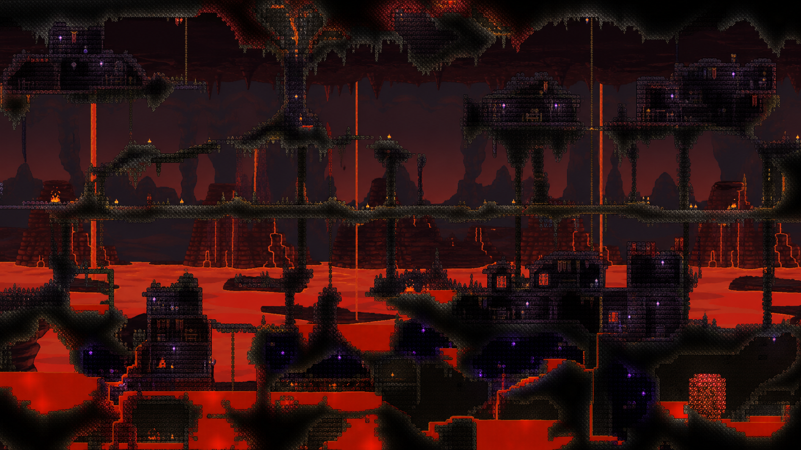

**Rank.** Biome application.

**Purpose.** The Underworld gains recognizable districts and safer natural approaches without reducing its lava, enemies, or combat pressure.

**Large-scale shape.** Ash shelves alternate with lava deltas, pillar fields, open fortress districts, and collapsed passages. Ruined Houses cluster where solid shelves can support them.

**Natural routes.** A broken but connected shelf route crosses most districts. Short bridges, narrow tunnels, and ruined structures span local gaps. Large lava fields retain at least one high crossing that does not require Lava Waders.

**Surface connection.** Cavern chimneys widen into ash caves before reaching open Underworld space. Direct hellevators still work and remain a valid player-made shortcut.

**Landmark variants.** Use an ash canyon, a lava delta, a pillar hall, a collapsed Ruined House district, an obsidian seep, or a Hellstone cut.

**Vanilla materials.** Use Ash, Hellstone, Obsidian, lava, Underworld brick sets, Ruined House furniture, pots, and background walls.

**Safeguards.** Preserve enough open space for the Wall of Flesh fight. Keep Ruined House loot and Hellforge access at vanilla expectations. Do not create an uninterrupted bridge across the whole layer. Avoid sealing the bottom of a hellevator with a hidden lava pocket.

## Progression sites keep their jobs

Richer Biomes can change the approach to a progression site, but it cannot change what the site means or how the player unlocks it.

| Site | Surrounding terrain idea | Function to preserve |
| --- | --- | --- |
| Spawn | A calm forest clearing within walking distance of one layered forest route. | Safe starting ground, trees, basic resources, and room for the first structures. |
| Dungeon | A road, eroded headland, mountain shelf, or coastal cliff leads to the entrance. | Old Man access, entrance visibility, Dungeon depth, locked content, and valid walls. |
| Jungle Temple | A larger approach cavern frames the outer wall without opening it. | A sealed structure, valid door and altar placement, traps, wiring, and required rooms. |
| Oceans | A coast transition explains the descent into each ocean. | Ocean size, fishing, enemy spawning, quest use, and world-edge protection. |
| Aether | A quiet stone basin and a distinct approach cave hint that the area is unusual. | Shimmer volume, transmutation use, protected placement, and side-of-world rules. |
| Floating Islands | Mountains and clouds provide distant visual hints. | World-size counts, houses, chest loot, and open sky around each island. |

## Hardmode conversion can follow the world's geology

**Rank.** Optional experiment with progression impact.

The initial world can reserve broad geological seams that cross several regions. After the Wall of Flesh is defeated, one family of seams becomes Hallow and an opposing family becomes Corruption or Crimson. The event still creates large surface and underground biomes. The difference is that converted terrain follows faults, ridges, basins, and existing cave routes instead of ignoring them.

The experiment must answer these questions before the idea becomes a requirement.

- Can geological conversion create enough Underground Hallow and Underground Corruption or Crimson for all required drops?
- Can it preserve the urgency and surprise of the vanilla Hardmode event?
- Can it protect the Jungle Temple, the Dungeon, the Aether, chests, and other sensitive structures?
- Can it leave existing routes open after tile conversion and Crystal Shard growth?
- Can players still understand biome spread and use familiar containment methods?
- Does the result remain fair on small worlds as well as large worlds?

If the experiment fails any progression check, keep vanilla conversion. Pre-Hardmode terrain must still tolerate the vanilla diagonal bands.

## Generation risks need isolated prototypes

### Route validation

A geometric path is not automatically playable. The validator must account for jump height, headroom, safe landing width, slopes, ropes, doors, liquids, and drops. Prototype one forest-to-mountain crossing before using the validator across a full world.

### Liquid placement

Water and lava can escape after later passes change nearby tiles. Prototype one local watershed, one flooded mine, and one ocean cave. Let all liquids settle, then inspect the structures and caves below them.

### Structure collisions

Large landforms can overlap the Dungeon, the Temple, the Aether, Floating Islands, cabins, mine tracks, and biome chests. Reserve protected bounds before detailed terrain passes. Test structures near region borders, where two generators are most likely to disagree.

### Terrain scale

Mountains and deep valleys consume much more vertical space than vanilla hills. Test all world sizes. Keep the Surface, Underground, and Cavern layers thick enough for their normal biomes, structures, and resources.

### Landmark density

A generator can satisfy every individual idea and still produce an exhausting world. Track major landmarks per region and inspect full-map silhouettes. Quiet stretches are a requirement, not leftover space.

### Seed stability and generation time

Validation retries and liquid settling can make generation slow or unpredictable. Record generation time and retry counts for fixed seeds. A failed optional landmark should degrade to quiet terrain instead of restarting the whole world.

## Suggested implementation order

1. Build the world skeleton with landform regions, protected structure bounds, quiet-space budgets, and a reserved surface route.
2. Prototype a vertical forest that crosses one valley and one ridge.
3. Add a cross-biome mountain with a pass, an outer climb, and an internal cave route.
4. Add a surface mine that merges into the forest's regional caves.
5. Validate the combined forest, mountain, and mine route with a starter character.
6. Add transition zones, then extend the terrain rules to desert, snow, jungle, evil biomes, and oceans.
7. Add regional Underground and Cavern shapes without changing resource balance.
8. Prototype local watersheds and settle all liquids before accepting the system.
9. Reframe progression sites while preserving their internal generation rules.
10. Add the Underworld terrain districts and confirm that the Wall of Flesh still has enough combat space.
11. Prototype geological Hardmode conversion last. Keep vanilla conversion as the fallback.

## Out of scope

This design does not add custom tiles, walls, plants, furniture, enemies, bosses, items, loot tables, music, quests, or progression gates. It does not promise compatibility with Calamity, Thorium, Remnants, or other mods that make broad world-generation changes. Those choices can be revisited after the core terrain works on its own.

The first success case is smaller: a new character can leave a calm spawn, choose among several forest routes, cross a mountain without building a dirt staircase, discover a mine from the surface, and follow it into caves that still feel like the biome above.
