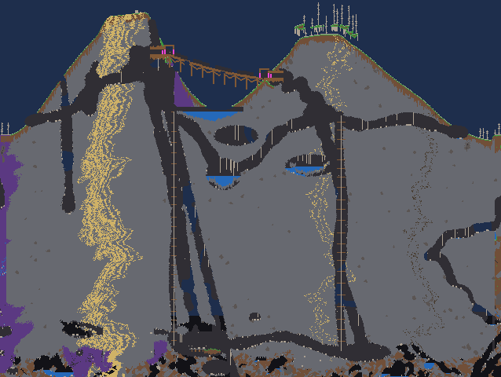

<p align="center">
  
</p>

# Vanilla Worlds Overhauled

**Overhauled worlds. 100% vanilla content.**

Vanilla Worlds Overhauled changes only new-world generation. It rearranges Terraria's existing tiles, walls, furniture, liquids, and loot into a network of large, varied places to explore. It adds no custom items, tiles, walls, enemies, NPCs, bosses, recipes, or progression systems.

The current release targets Terraria 1.4.4.9 on tModLoader 2026.07.3.0.

> Vanilla Worlds Overhauled works during world creation. Enable it before generating a new world; it does not retrofit existing worlds. Secret seeds are currently left unchanged.



The showcase world used the numeric seed `882350129`. The exact result is deterministic for the same mod and tModLoader versions.

## What it generates

- Ground-connected mountain ranges with varied heights, zigzagging cave chains, broad chambers, open-background pockets, natural spawn shelves, biome-rooted growing vines, ponds, and two surface entrances. Bridges enter traversable mountain passages, and some stone crossings become functional graveyards.
- Large floating highlands with terraced meadow, cloud basin, or broken archipelago forms. Mountain attachment is occasional, not the default.
- Biome-specific landmarks with multiple rooms, floors, stairs, roof shapes, furniture sets, and blended foundations. Snow landmarks can become buried igloos. Every landmark deliberately fails NPC housing checks so it cannot bypass progression.
- Occasional forest lakes and terrain-integrated bridges with irregular shores, beds, supports, and approaches. Stone variants can become tombstone-lined graveyard crossings.
- Broad, correlated biome and material transitions. Natural terrain, walls, foundations, and structure joins avoid straight rectangular generator seams.
- One guaranteed visible surface mine leading into an interconnected Cavern rail district with junctions, cycles, work lines, timber supports, furniture, flooded areas, collapses, mountain routes, and sealed world-evil sections.
- Protected spawn ground, building terraces, regional cave routes, and quieter construction space between major landmarks.

Vanilla Worlds Overhauled leaves vanilla loot tables and progression sites intact. Its generators protect the Dungeon, Jungle Temple, Aether, chests, wiring, and other progression-sensitive content.

## Continue in vanilla Terraria

The companion utility [Export Worlds to Vanilla](../world-to-vanilla/README.md) can copy a completed `.wld` from tModLoader's World Select screen into vanilla Terraria. This exports the generated world, not the mod or its `.twld` metadata. Content introduced by other enabled mods may not transfer to vanilla Terraria.

## Install for local play

Build and install the package with:

```bash
./scripts/build-mod.sh
```

The script places identical package bytes at:

- `.playtest/build-save/Mods/VanillaWorldsOverhauled.tmod`
- `${TML_SAVE_DIRECTORY:-$HOME/.local/share/Terraria/tModLoader}/Mods/VanillaWorldsOverhauled.tmod`

Reload mods or restart tModLoader after installing a new build.

## Install as a mod source

To expose this checkout in tModLoader's **Develop Mods** screen, run:

```bash
./scripts/install-mod-source.sh
```

It creates `${TML_SAVE_DIRECTORY:-$HOME/.local/share/Terraria/tModLoader}/ModSources/VanillaWorldsOverhauled` as a symbolic link to this directory. Normal builds verify that link automatically and refuse to overwrite an unrelated path.

## Verify world generation

Generate a deterministic playtest world by choosing a mode, size, and unique seed:

```bash
./scripts/generate-playtest-world.sh --classic --size small --seed Majesty-Small-001
./scripts/generate-playtest-world.sh --journey --size medium --seed Majesty-Medium-001
./scripts/generate-playtest-world.sh --classic --size large --seed Majesty-Large-001
```

The harness builds and installs the mod, runs tModLoader in a pseudo-terminal, requires strict validation, reloads and saves the world, and verifies the saved generation manifest after another reload. It preserves diagnostic logs under `.playtest/Logs` and refuses to overwrite an existing world.

Run the complete size and difficulty matrix with:

```bash
./scripts/validate-worldgen-matrix.sh
```

Install a generated world into the regular tModLoader save with the same mode, size, and seed:

```bash
./scripts/install-playtest.sh --classic --size large --seed Majesty-Large-001
```

## Design and implementation notes

- [MOD_DESIGN.md](MOD_DESIGN.md) owns the current generation grammar, pass ordering, compatibility boundary, and validation contract.
- [WORLDGEN_IDEAS.md](WORLDGEN_IDEAS.md) is the broader design catalog.
- [WORLDGEN_FUTURE_WORK.md](WORLDGEN_FUTURE_WORK.md) maps implemented, partial, and untouched world-generation areas.
- [WORLDGEN_RESEARCH.md](WORLDGEN_RESEARCH.md) records reference-world research and verification results.
- [release-assets/README.md](release-assets/README.md) records the release artwork source and reproducible icon brief.
